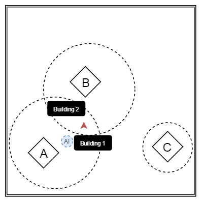
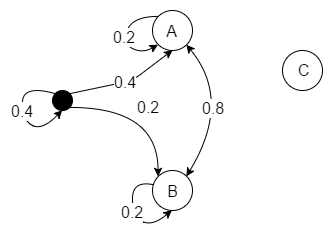

# game-design-development

## Requirement

Design a game with joint probability AND with
conditional probability. You will need a source of
randomness (flipping coins, dice, etc.).
  + Read Chapter 29 from Players Making Decisions to
understand what you need to do.

Present the game in front of the class. (2 min)

## A dynamic quest system based on probability

`Joint probability` - p(A && B) - probability of A and B to happen at the same time  
`Conditional probability` - p(A | B) - probability of A, given B

### Description

Consider a quest system where:
+ A, B, C are quests/events
+ A and B are related <=> not necessarily chronological events, but from the same path:
  + if the game designer wants, he can constrain them to happen:
    + almost immediately
    + with a very high probability: in chronological/random order
+ C is an unrelated event, with zero probability of triggering while the player is out of the proximity area

Obs: To promote `randomness` in the game and a `non-linear gameplay`, the idea that proximity areas only influence, but not dictate probability should be considered  
<=> C `may also happen with some degree of probability`, and promote exploring in the game (eg: `Skyrim` gave missions to the player at some long distances, without offering the possibility of `fast travelling` initially)  
<=> this `randomness can be a parameter in the game` that can be varied

### Mechanics

Depending on the player location, he can have some probability to encounter an event that triggers either mission A or B, or none.  
If mission A is triggered:
+ an `AI is spawned behind the player` / behind the building, and move to get in player's FOV (field of view)
+ `player gets assigned mission in the UI` / quest log  
After mission A is finished, you will have a much higher chance to trigger mission B (`conditional probability`).

Obs: `Joint probability` can occur in this context if both events are triggered and the player must choose one of those (and, such that the decision is meaningful, it should have a consequence).

> An example map

### Implementation / Formalization

We can view this map as a dynamic Markov Chain, based on the player position:
+ nodes appear in the chain when you are in their `proximity area`
+ probability is based on distance to the nodes (must sum to 1)
+ probability to remain in the same state means you don't get a new quest, depending on:
  + your location
  + your progression in the game

If A -> B (A related to B) => there should be a higher conditional probability

> A formalization of the previous map
