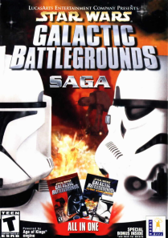

# game-design-development

## Requirement
Analyze a game that you are familiar with by identifying
the following elements:
+ Players, Objectives, Procedures, Rules, Resources,
Conflict, Boundaries and Outcome

### Age of Empires 2 / Star Wars Galactic Battlegrounds

#### Players
Interaction depends on mode:
+ campaign mode - 1 vs multiple
+ custom mode - all (`1 vs 1`, `1 vs multiple`, `multiple vs 1`, `multiple vs multiple`)
+ online (LAN or public server) - idem

#### Objective
Usually they are the same, except for campaign, when they may differ:
+ campaign - `go there`, `do that` - mission specific
+ others/generally:
  + build a base - walls & fortress, extend your base
  + extend your economy - more mines, more workers, "passive" income (gold through relics or gold through trading), trading
  + build an army
  + defend against / attack enemies

Employ `various strategies` in order to achieve your objective:
+ `rushing` attack against enemy economy: http://www.forgottenempires.net/aof/strategy/feudal-rushing
+ `fast castle`: https://www.quora.com/In-Age-of-Empires-II-what-is-the-build-order-for-a-fast-castle

#### Procedures

Commands:
+ select unit/building (**Contextual commands after running this**)
+ communicate / taunt
+ set diplomacy stance
+ set minimap options
+ open tech tree / menus

Contextual commands - `Units`:
+ move
+ attack / build
+ repair - building / ships / special units
+ kill
+ garrison
+ stance - one of the following: aggresive, defend, stand point, no attack stance
+ deploy (only for special units)

Contextual commands - `Building`:
+ build unit
+ research
+ set garrison point
+ send workers back to work / ungarisson
+ attack (only for defence buildings - tower, fortress, garrisoned command center)

#### Rules:
+ in order to survive, you have to extend your `economy` and `army`, if you don't have both, you will lose (unless you're protected by an ally, usually in online interaction)
+ you can only control your troops / building
+ most games have fog-of-war
+ you can change diplomacy stances (unless locked)
+ rock-paper-scissor with units

#### Conflict
+ you have one or more enemies that you have to beat
+ you have zero or more allies, that you shouldn't rely on to `carry` the game

#### Boundaries
+ map - limited map
+ time - you have a time limit in certain game types, or you're constrained by game speed (a match/game shouldn't last more than ~1 hour, if not a campaign mission)

#### Outcome

Victory conditions:
+ standard win (forced enemies to resign - through military action, usually)
+ relic win (captured all relics and withstood 100 days)
+ monument win (built monument that withstood 100 days)
+ economic win (first to reach sum) ???

### Game design issues

