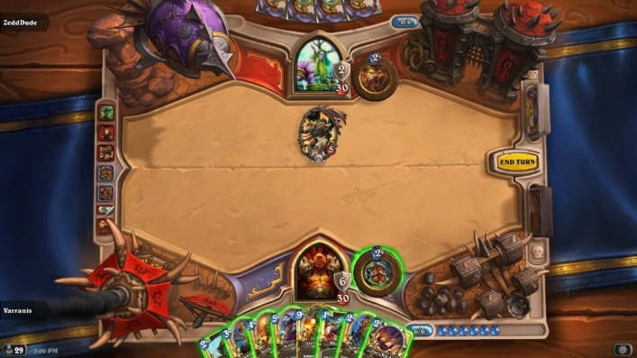
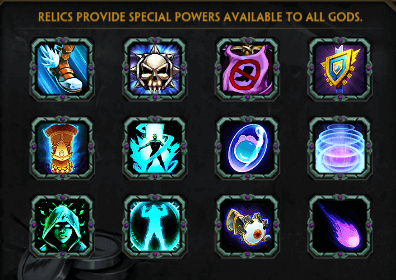
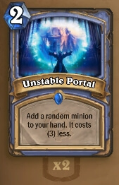
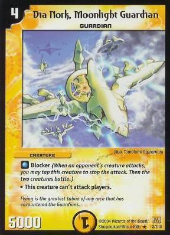
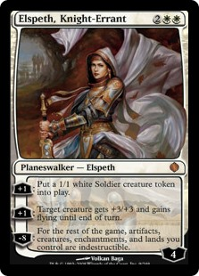
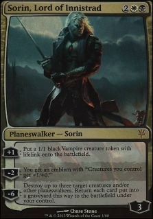

# game-design-development

## Requirement
 Construct a card game where the players will have
one meaningful and two meaningless decisions. 

## "Not-Hearthstone" (inspired by "Not - Magic: The Gathering")

### Rules & Mechanics

#### Abilities
A player has 3 abilities:
+ an ability with no mana, once per game - eg: draw a card / get 1 mana (similar to coin, but any player should have it)
+ an ability with `2 mana`, `once per turn` (class specific) - similar to Hearthstone, you either use your mana on cards or on ability
+ an ability that `consumes all mana` (all mana or all mana left ?), `once per game` (player chosen) - player saving (prolongs the game)

> Similar to relics in Smite (season 3), for example a correspondent of Sanctuary would be the Iceblock (secret, mage class)

> You could take known cards and give them as a ability to any class / somehow buff them. For example, Unstable portal could consume all mana and you could get 2 random minions in your hand

Why ?
+ will make the game a bit slower, especially since you have an ability that will use up all your mana and protect the opponent if you rush him too fast

#### Attack stances (inspired by Yu-Gi-Oh! / Duel Masters)
A card can be in `2 positions`, `attacking` or `defensive`:
+ For every turn that you have a card in attacking position, you will be drained of `1 mana/card`.
For a card to attack, it needs to be in attacking position. Otherwise, a defending card has to `wait a turn` to `change stance` (or `consume 2 mana` to change stance).
+ If you have more than 3 defending cards on board, all cards that will be put on the board will have to be in `attacking stance`.
+ If you keep a card in `defend` stance more than 3 turns, it will be changed automatically to attacking stance.

Obs: Regardless of stance, a card will consume mana when cast.

Some further rules:
+ minions can attack in first round only if they are in attack position (no summon sickness ?)
  + provided there are no glass cannons (eg: 2-5-1 cards - 2 mana, 5 attack, 1 health)
+ in defence, minions have taunt and can't attack
+ if you are in defence, the opponent has to attack (taunt can't be silenced)
+ stats varied by stance

> Some common blocker card from Duel Masters

Why ?
+ HS used to have strategies like `grim patron` or `face hunter`, where you will have populated the board and attack the enemy hero or cleared his board - with the extra constraints, filling the board will make impossible for you to use more secrets, spells, while also using a populating strategy
+ game should also not go into the other extreme and play fatigue; minions with big health either are removed or have slightly less health in defend

#### Minions with abilities (inspired by Magic: The Gathering)
+ emblem - applies an effect for everything that is on the board / will be summoned to the board
+ planeswalkers - characters based on loyalty/health, gaining or losing loyalty (minor effects used for buffing, major effects cost a lot)
  + ultimates on planeswalkers aren't too often used, because most players won't have time to get to that point (or the character will be destroyed), and/or the sacrifice of the card for the ultimate won't be worth it  
eg:  or 

**Examples**

> Elspeth, Knight-Errant

> Sorin, Lord of Innistrad

#### Trading 

Almost any card game has it ... goes without saying

#### Spells that can be activated at any moment in game (inspired by Magic: The Gathering)

Instant / Flash spells, for example - more [here](https://boardgames.stackexchange.com/questions/14908/what-can-be-played-during-an-opponents-turn)

---

## Meaningful decisions:
+ you can take a `trade-off decision` by delaying a combo for populating the board, and waiting for more mana to strenghten the combo (thus becoming a `risk/reward decision`)
+ the ability that consumes all mana can be chosen before the game starts, and will be powerful ... you should use it wisely, because it's the most powerful ability you will have, and you use up all your mana in the process
  + using all mana, if you need a full bar, will be maybe too costly to be worth it ?
  + it's a `risk/reward decision` - you use all your mana and you risk, but that ability might save you (even though it isn't always the obvious one)

## Meaningless decisions:
+ choosing to play a 7-6 minion or a 6-7 minion, when you can't guess what are the opponents cards (so as to calculate what you need more)
  + it's a `blind decision`, under the circumstances aforementioned
+ the ability with no mana is a choose between "get 1 mana" and/or "draw a card" or "discover a card"
  + in a critical moment, it may be useful, otherwise it will be used randomly by players, so it will not count
  + it's an `obvious decision` to use in early game, for example
+ numerous `obvious decisions` such as:
  + playing cheap taunt cards (`Mirror Image`, for example, is a spell that summons 2 0-2 taunt minions) when you need to protect face or your minions, choosing 
  + not choosing cards >5 mana at the initial draw, unless they are for board control (eg: `Flamestrike`)
  + ...

