# game-design-development

## Requirement
For each of the genres you have been assigned, 
identify a game and explain why is it of that genre in
front of the class in 2 minutes.

## Genres

I was assigned the following genres:
+ 7 - simulation / building
+ 4 - sports
+ 3 - role-playing - RPG

I've chosen the following games:
+ 7 - KSP (Kerbal Space Program)
+ 4 - FIFA 2002
+ 3 - Witcher 3

---
### KSP - Kerbal Space Program
[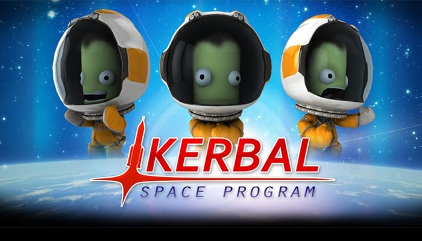](https://www.youtube.com/watch?v=n4LoyxNAx1g)

+ player has to build a space ship

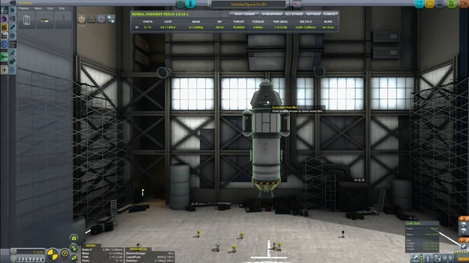

+ game simulates the launch of that spaceship, under various variables (environment, speed ...)

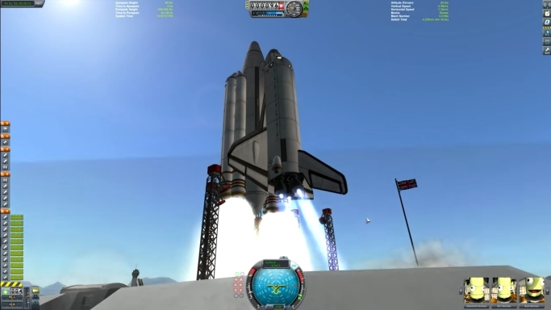

+ player has control over piloting, trajectory

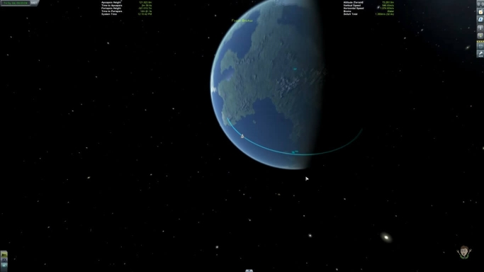

---
### FIFA 2002
[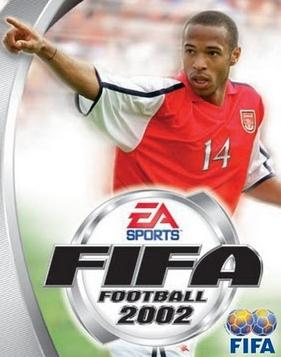](https://youtu.be/7dBfrnTushM?t=3m36s)

+ has sports as the main subject
+ you control the team/player

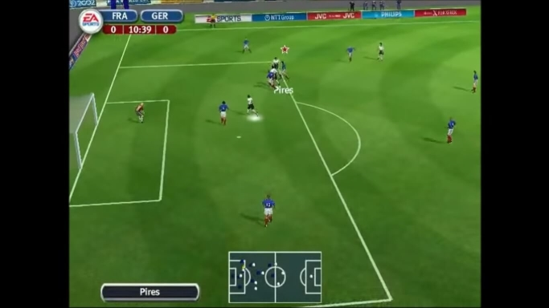]

+ you need to score as much goals as possible
+ emulates real sports, for example commentary and replays

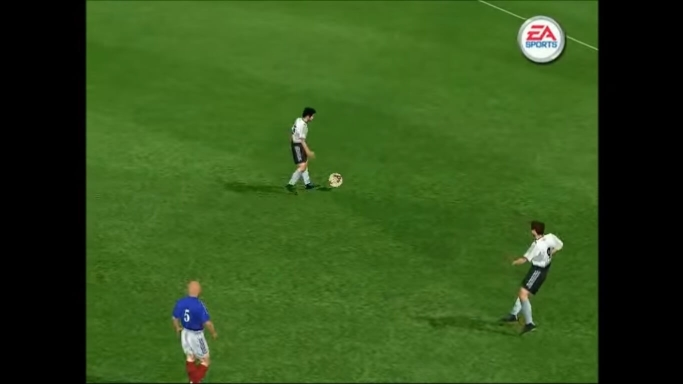]

---
### Witcher 3
[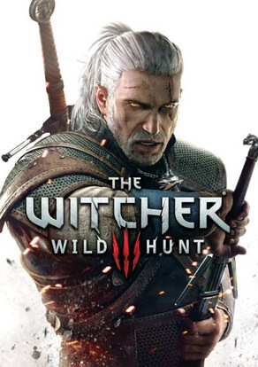](https://youtu.be/xUcFjRzuDP0?t=25m45s)

+ even though you don't have control over how the base model looks (as you usually have in freestyle RPGs), you can stylize the  hair, weapons ...
+ you have inventory, alchemy, map, quests menus

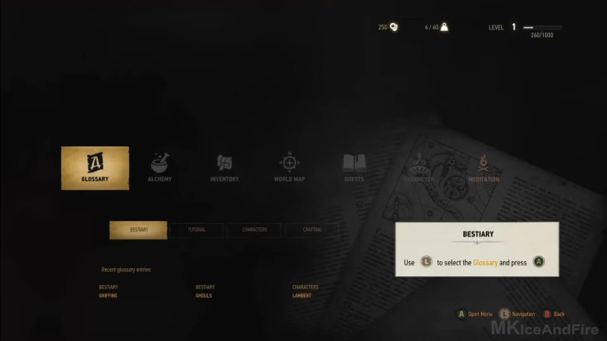

+ you have levels and abilities
+ you have a basic dialogue system, that affects certain relationships and leads to some consequences in game

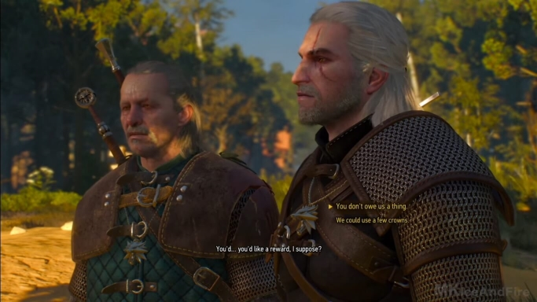

+ mechanics like - gathering materials to prepare potions
+ trading - you gather gold to buy weapons

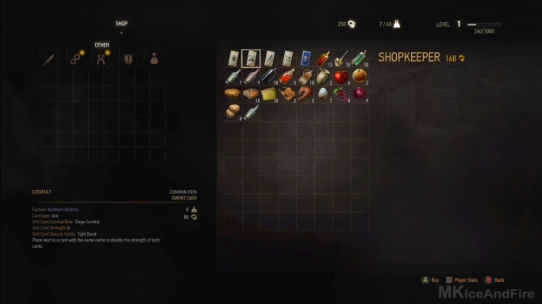

+ you have an open world
+ you have side-quests and main quests

