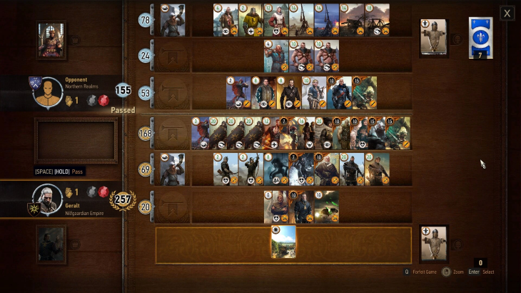

# game-design-development

## Requirement
Design a card game for two players:
+ the second player will have the role of the „system”
+ the difficulty of the game adjusts with the
progression of the first player
+ Playtest! Take notes on the experience.
Present in front of the class, explaining if you succeded
to create a state of flow for the first player. (2 min)

## Siege (inspired by Gwent)


> Gwent Example

Second player (AI/system) is in defense, protecting a castle. Castle has a number of hitpoints.

```
------------
System
Hitpoints: 1000
____  ____
|___| |___|
defending cards

--
no man's land
--

___   ___   ___
|  |  | A|  |  |
|__|  |__|  |__|
attacking cards (swordsman, hero in the center)
____  ____
|___| |___|
attacking cards (archers)
___   ___
|  |  |  |
|__|  |__|
attacking cards (siege)


Player
------------
```
> How the board should look

### Card asignment
This game uses the standard [52-card deck](https://en.wikipedia.org/wiki/Standard_52-card_deck).

Is the game using 2 card set, or just one ?
Are the cards assigned randomly, or split into subsets ?

### Naming cards

Are chosen such that they keep proportionality:
+ Jack/Queen/King are siege cards
Ace is hero

2-10 are foot soldiers (swordsmen / archers):
+ any card from the interval can be swordsmen / archer - red is archer, black is swordsman
+ number indicates experience


### Rules
+ win conditions:
  + player loses when no attacking cards are left / all att cards are destroyed / morale is used
  + system loses when hitpoints have been reduced to 0
+ rock-paper-scissor:
  + archer in defense beats attacking swordsman (reverse is true)
  + siege in defense beats attacking ... ?
  + siege in attack beats defending archer
  + swordsman in attack beats defending swordsman if force(numbers)/morale(hero+health) is higher


## Game Flow

It needs to achieve the following:
+ **clear set of goals**: rules defined above
+ **clear progress**:
  + task shouldn't be seen as too easy ( player skill increases): 
    + `strategy`: if you try to rush, you will encounter oil
    + `progress`: difficulty increase, troop hitpoints increase, troop numbers increase
  + task shouldn't be seen as too hard (game's challenge increase): 
    + `strategy`: if you can't attack frontally, you can siege the castle through ranged units (cheaper, but longer)
    + `progress`: you are guaranteed to get cards from any class (`swordsman`, `archer`, `siege`, `hero`)
+ **task must have clear and immediate feedback so the player cand adjust his actions as needed**: for every round the player goes through, he knows the feedback/actions of the system and the consequences of his/her actions


